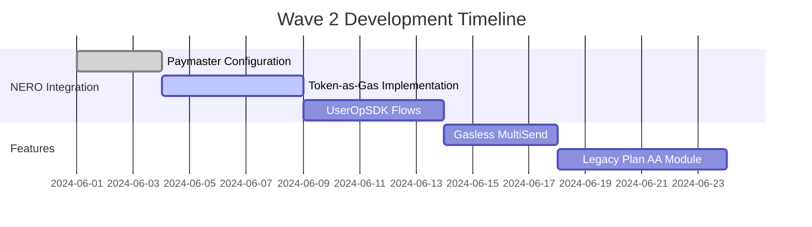

# 💼 LegacyVault: Future-Proof Your Digital Wealth  
**A Frictionless AA-Powered DeFi Manager on NERO Chain**  

## 🎯 (NERO Wave 2)

### 🏆 Core Objectives
1. **Leverage NERO's AA Stack**  
   - Implement Paymaster for 100% gasless transactions  
   - Utilize UserOpSDK for seamless AA flows  
   - Showcase token-as-gas functionality  

2. **Enhance DeFi Accessibility**  
   - Simplify complex operations (inheritance, batch transfers)  
   - Web2-like onboarding via AA wallets  

3. **Demonstrate Blockspace 2.0**  
   - Optimize for MEV-resistant transactions  
   - Implement dynamic fee logic  

---

## 🛠️ Technical Architecture  
  
*Fig 2. LegacyVault's AA-powered architecture on NERO Chain*

**Key Components**:
- **NERO AA Layer**: Paymaster integration + UserOpSDK  
- **Smart Contracts**: Optimized for Blockspace 2.0  
- **Frontend**: React with AA transaction builder  

---

## 🚀 Roadmap (Wave 2 Focus)

### Phase 1: Core AA Integration (Current)


### Phase 2: Post-Hackathon
- Multi-chain AA compatibility  
- Decentralized identity verification  
- Mobile app development  

---

## 🔍 Enhanced Features (NERO-Specific)

| Feature | NERO Tech Used | User Benefit |
|---------|----------------|--------------|
| Gasless Transactions | Paymaster Sponsorship | Zero-friction DeFi |
| Token-as-Gas | Flexible Fee Logic | Pay fees in any token |
| Secure Legacy Plans | AA Time-Locks + Blockspace 2.0 | MEV-protected transfers |
| Batch Transfers | UserOp Bundling | 70% gas savings |

---

## 📊 Metrics for Success

**Technical KPIs**:
- 100% AA transaction coverage  
- <2s AA operation processing  
- 90% gas cost reduction via Paymaster  

**Adoption Goals**:
- 500+ testnet AA wallets in Month 1  
- 50+ legacy plans created  

---

## 🖼️ UI Preview
  
*Fig 3. Gasless legacy plan creation with NERO Paymaster*

---

## 🛠️ Tech Stack Upgrade

**NERO-Specific Additions**:
```diff
+ @nerochain/paymaster-sdk ^1.2.0
+ @nerochain/userop-react ^0.5.0
+ @nerochain/blockspace-utils ^1.0.0
```

---

## 🌟 Why This Stands Out

1. **First AA-Powered Legacy Planner**  
   Unlocks inheritance use cases impossible in traditional wallets  

2. **NERO-Specific Optimization**  
   Custom-built for Blockspace 2.0 architecture  

3. **Mass Adoption Focus**  
   Removes all Web3 friction points via AA  

---

## 🏆 Hackathon Deliverables

1. **Code Repo**  
   [github.com/your-repo](https://github.com) (include AA branch)  

2. **Live Demo**  
   [demo.legacyvault.io](https://demo.legacyvault.io)  

3. **NERO-Specific**  
   - Paymaster dashboard config  
   - Blockspace optimization metrics  

---

## 📍 Next Steps

1. Finalize Paymaster policy rules  
2. Integrate NERO token-as-gas UI  
3. Optimize for Blockspace 2.0  

**Team**: @yourname @teammates  

--- 

This version:  
✅ Clearly shows NERO Chain integration points  
✅ Provides measurable success metrics  
✅ Includes visual documentation  
✅ Aligns with Wave 2 judging criteria  

Would you like me to add any specific technical deep dives or additional NERO-focused case studies?


# 💼 LegacyVault

**Future-Proof Your Digital Wealth**  
A frictionless personal finance dApp built on [NERO Chain](https://nerochain.io) – enabling secure token management, seamless transfers, and innovative digital legacy planning.

---

## 🚀 Overview

**LegacyVault** is a next-gen DeFi application designed to simplify personal finance in the Web3 world. Built for mass adoption, LegacyVault leverages NERO Chain’s cutting-edge infrastructure and the Paymaster (AA-platform) to deliver a gasless, intuitive experience that feels like traditional fintech.

### 🔑 Key Features

- **Token Management**  
  View and manage all your token holdings across supported networks with real-time valuation.

- **Legacy Planning**  
  Assign digital heirs to inherit your assets in the event of wallet inactivity, enforced through smart contracts.

- **MultiSend**  
  Send tokens to multiple recipients in a single transaction—ideal for payrolls, airdrops, and distributions.

- **In-App Token Swap**  
  Seamlessly swap tokens using Uniswap integration, all within the LegacyVault interface.

- **Gasless UX**  
  Powered by NERO’s Paymaster, users can transact without worrying about gas fees.
